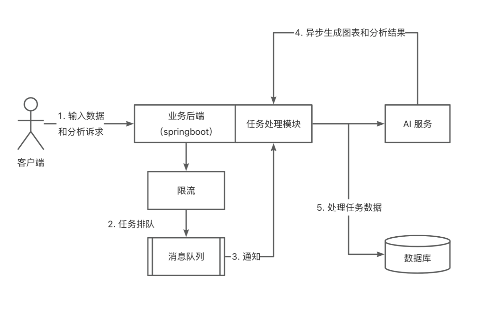

# 可视化数据智能分析平台
项目描述：基于可视化AIGC数据智能分析平台旨在通过集成先进的数据处理和可视化技术，为用户提供深入的洞察和分析支持。通过ai分析生成分析报告支持决策制定和业务优化，使用户能够高效地分析和可视化来自多种数据图例的AIGC数据。
项目框架图：

技术栈
- SpringBoot
- Redis
- MySQL
- React
- RabbitMQ
- Easy Excel
- MyBatis-Plus
测试账号：
账号：admin
密码：123456
